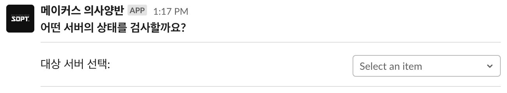

# 메이커스 의사양반

메이커스 서버들이 잘 동작 중인지 확인해주는 슬랙 봇

## 기능

- 서버 상태 체크 슬랙 명령어
  - 명령어 입력 시, 서버 선택 메시지 표시
  - 서버를 선택 시, 해당 서버 상태 검사
- 자동 서버 상태 체크
  - 1분 간격으로 서버들의 상태 검사
  - 서버에 문제가 있으면 슬랙에 메시지 전송
  - 오류 메시지는 30분 간격으로만 전송
  - 서버가 오류에서 회복되면 메시지 전송

## 기술 스택

- TypeScript
- [Cloudflare Workers](https://workers.cloudflare.com/)
- [Slack Web API](https://api.slack.com/docs)

## TODO

- 메시지 검증 추가
